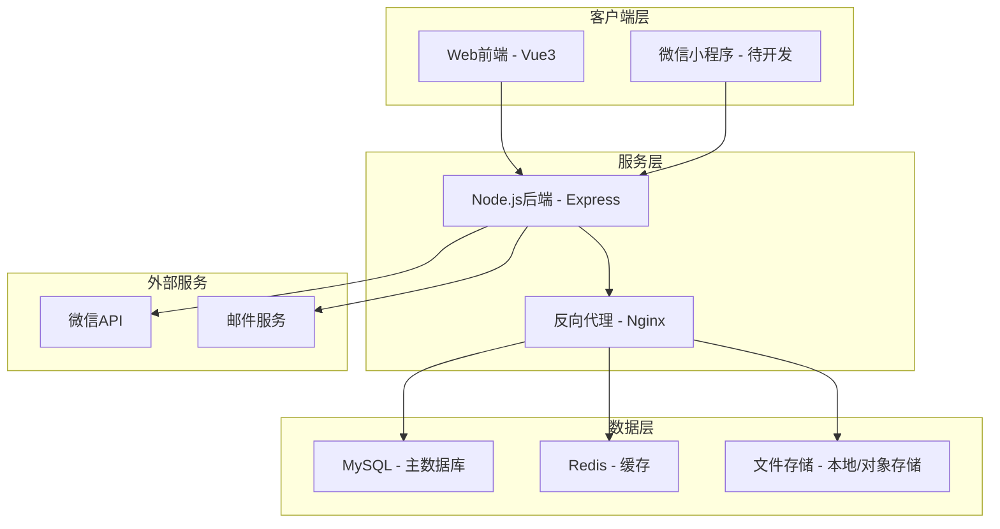
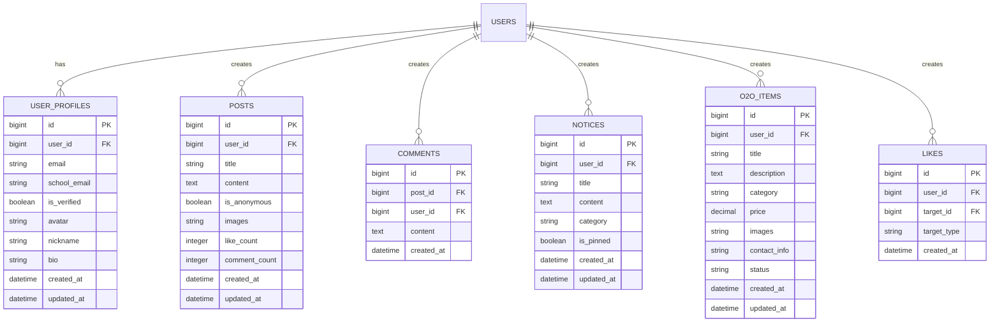
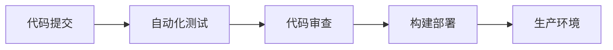

# 技术方案设计

## 系统架构

### 整体架构图

## 技术选型

### 后端技术栈
- **运行环境**: Node.js 18+
- **Web框架**: Express.js 4.x
- **数据库**: MySQL 8.0
- **缓存**: Redis 6.x
- **认证**: JWT + Session
- **API文档**: Swagger/OpenAPI
- **日志**: Winston
- **测试**: Jest + Supertest

### 前端技术栈
- **框架**: Vue 3 + Composition API
- **构建工具**: Vite
- **路由**: Vue Router 4
- **状态管理**: Pinia
- **UI组件**: Element Plus
- **HTTP客户端**: Axios
- **样式**: SCSS + Tailwind CSS
- **类型检查**: TypeScript

### 数据库设计

#### 核心数据表

## 接口设计

### 认证相关接口
- `POST /api/auth/wechat-login` - 微信扫码登录
- `POST /api/auth/send-email-verify` - 发送邮箱验证码
- `POST /api/auth/verify-email` - 验证邮箱
- `POST /api/auth/refresh-token` - 刷新Token
- `POST /api/auth/logout` - 退出登录

### 用户相关接口
- `GET /api/users/profile` - 获取用户信息
- `PUT /api/users/profile` - 更新用户信息
- `GET /api/users/posts` - 获取用户帖子列表

### 内容相关接口
- `GET /api/posts` - 获取帖子列表
- `POST /api/posts` - 创建帖子
- `GET /api/posts/:id` - 获取帖子详情
- `PUT /api/posts/:id` - 更新帖子
- `DELETE /api/posts/:id` - 删除帖子

### O2O相关接口
- `GET /api/o2o/items` - 获取O2O物品列表
- `POST /api/o2o/items` - 发布O2O物品
- `PUT /api/o2o/items/:id` - 更新物品信息
- `DELETE /api/o2o/items/:id` - 删除物品

### 通知相关接口
- `GET /api/notices` - 获取通知列表
- `POST /api/notices` - 创建通知（管理员）
- `GET /api/notices/:id` - 获取通知详情

## 安全设计

### 认证机制
- **JWT Token**: 使用HS256算法，有效期2小时
- **Refresh Token**: 用于刷新访问Token，有效期7天
- **密码安全**: 使用bcrypt哈希存储密码
- **邮箱验证**: 邮箱验证码有效期10分钟

### 数据安全
- **输入验证**: 所有输入数据都进行验证和清理
- **SQL注入防护**: 使用参数化查询
- **XSS防护**: 对用户输入进行HTML转义
- **文件上传安全**: 检查文件类型和大小

### 访问控制
- **角色权限**: 普通用户、管理员不同权限
- **API限流**: 防止恶意请求
- **CORS配置**: 限制跨域访问

## 部署方案

### 开发环境
- **代码管理**: Git + GitHub
- **开发工具**: VS Code + 插件
- **本地环境**: Docker Compose

### 生产环境
- **服务器**: Linux CentOS 7+
- **Web服务器**: Nginx
- **进程管理**: PM2
- **数据库**: MySQL主从复制
- **监控**: 日志监控 + 性能监控

### CI/CD流程

## 测试策略

### 单元测试
- **后端**: Jest测试API接口和业务逻辑
- **前端**: Vue Test Utils测试组件

### 集成测试
- **API测试**: Supertest测试完整的API流程
- **数据库测试**: 测试数据库操作和数据一致性

### 性能测试
- **压力测试**: 使用JMeter模拟高并发场景
- **负载测试**: 测试系统在不同负载下的表现

## 监控和运维

### 日志管理
- **应用日志**: Winston记录应用运行日志
- **访问日志**: Nginx访问日志
- **错误日志**: 错误追踪和报警

### 性能监控
- **系统监控**: CPU、内存、磁盘使用率
- **应用监控**: 响应时间、错误率、并发数
- **数据库监控**: 查询性能、连接数

### 备份策略
- **数据库备份**: 每日全量备份 + 实时binlog备份
- **文件备份**: 定期备份用户上传文件
- **配置备份**: 版本控制配置文件