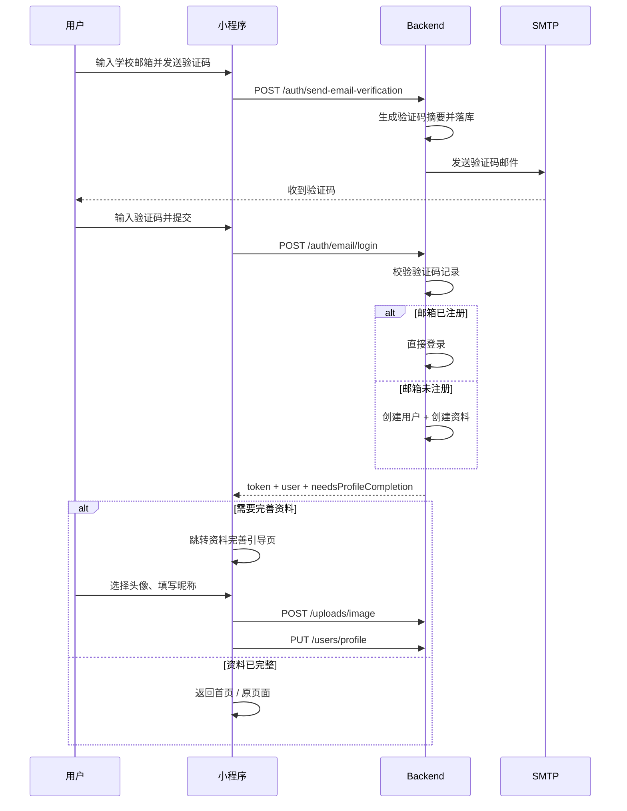

# 技术方案设计

## 概述

本次改造基于现有架构继续演进，不改动“微信云托管 + Node/Express 后端 + 小程序 JWT 会话”这一主路径。

目标是完成三件事：

1. 将当前“认证中心”页面重构为“邮箱登录 / 注册”页面。
2. 在后端补齐真正可用的邮箱验证码登录闭环，支持“未注册邮箱验证码登录即自动注册”。
3. 在登录成功后立即进入“资料完善引导页”，引导用户补充微信头像和昵称，再保存到后端。

## 架构设计

### 前端

- 继续复用现有登录入口页 `pages/auth/email-verify/index`
- 页面语义调整为“邮箱登录 / 注册”，保留学校邮箱输入与验证码输入
- 登录成功后，根据资料完整度决定是否跳转到新的引导页 `pages/profile/onboarding/index`
- 未登录时允许浏览；需要身份的操作继续使用 `ensureLogin()` 前置拦截
- `401` 继续由 `utils/request.js` 统一处理，清理会话并跳转登录页

### 后端

- 复用现有 `backend/src/controllers/authController.js`
- 保留 `POST /auth/send-email-verification`
- 新增统一登录接口 `POST /auth/email/login`
- 该接口在验证码通过时执行：
  - 已有用户：直接登录
  - 无用户：自动创建账号、自动创建 `UserProfile`、再登录
- 返回中增加资料完善状态字段，供小程序决定是否跳转到引导页

### 数据层

- 复用现有表 `email_verification_tokens`
- 扩展 `type` 枚举，新增 `school_email_login`
- 继续使用 `token_hash` 字段存储验证码摘要，不保存明文验证码
- 每次发送新验证码前，作废同邮箱同用途下未使用且未过期的旧记录

## 页面与交互设计

### 1. 邮箱登录 / 注册页

页面：`pages/auth/email-verify/index`

调整内容：

- 标题从“认证中心 / 完成认证”改为“邮箱登录 / 注册”
- 说明文案改为：
  - 使用 `@binghamton.edu` 邮箱获取验证码
  - 已注册邮箱输入验证码即可登录
  - 未注册邮箱验证成功后自动创建账号并登录
- 主按钮从“完成认证”改为“登录 / 注册”
- 登录成功后不直接 `navigateBack`，而是根据返回状态跳转：
  - 资料完整：返回上一页或回首页
  - 资料不完整：跳转 `pages/profile/onboarding/index`

### 2. 首次资料完善引导页

新增页面：`pages/profile/onboarding/index`

职责：

- 登录成功后立即展示
- 只处理“头像 + 昵称”两个字段
- 允许“稍后再说”
- 用户提交后保存并进入主流程

交互方案：

- 头像使用微信官方能力 `button open-type="chooseAvatar"`
- 昵称使用微信官方能力 `input type="nickname"`
- 用户确认保存时：
  1. 若头像是本地临时路径，先走现有上传接口 `/uploads/image`
  2. 再调用资料更新接口保存 `avatar` 与 `nickname`
- 若用户跳过：
  - 标记本次引导完成
  - 不影响当前登录态
  - 后续可在个人资料页自行修改

## 接口设计

### 1. 发送验证码

`POST /auth/send-email-verification`

请求：

```json
{
  "email": "abc@binghamton.edu"
}
```

处理逻辑：

1. 校验邮箱格式与域名
2. 生成 6 位验证码
3. 使用 `sha256(email + code + type + secret)` 生成摘要写入 `token_hash`
4. 记录 `expires_at`，建议 10 分钟
5. 使用 SMTP 发信
6. 生产环境不返回验证码明文

响应：

```json
{
  "message": "验证码发送成功"
}
```

### 2. 邮箱验证码登录 / 自动注册

`POST /auth/email/login`

请求：

```json
{
  "email": "abc@binghamton.edu",
  "code": "123456"
}
```

处理逻辑：

1. 校验邮箱、验证码是否存在
2. 以 `school_email_login` 用途查询未使用、未过期验证码记录
3. 校验验证码摘要
4. 命中后将该记录标记 `used_at`
5. 按邮箱查找用户：
   - 若存在，直接登录
   - 若不存在，创建用户与 `UserProfile`
6. 更新 `last_login`
7. 返回令牌、用户资料摘要、`needsProfileCompletion`

响应：

```json
{
  "message": "登录成功",
  "user": {
    "id": 1,
    "username": "wx_abcd1234",
    "email": "abc@binghamton.edu",
    "role": "user",
    "status": "active",
    "email_verified": true,
    "profile": {
      "nickname": null,
      "avatar": null
    }
  },
  "emailVerified": true,
  "needsProfileCompletion": true,
  "accessToken": "xxx",
  "refreshToken": "xxx"
}
```

### 3. 保存头像与昵称

优先复用现有接口：

`PUT /users/profile`

请求：

```json
{
  "nickname": "小王",
  "avatar": "https://..."
}
```

原因：

- 已支持认证态
- 已支持 `nickname` / `avatar`
- 已接入微信内容安全校验
- 不需要维护第二套资料更新接口

## 数据模型设计

### 复用表 `email_verification_tokens`

当前模型只支持 `non_edu_onboarding`，需要扩展为：

```text
type: ENUM('non_edu_onboarding', 'school_email_login')
```

记录约定：

- `email`: 登录邮箱
- `token_hash`: 验证码摘要
- `type`: `school_email_login`
- `expires_at`: 过期时间
- `used_at`: 使用时间
- `user_id`: 登录成功后可选回填
- `request_id`: 保持 `null`

### 用户创建策略

若邮箱首次登录：

- `users.primary_email = email`
- `users.email_verified = true`
- `users.password = null`
- `users.username` 自动生成唯一值

用户名生成建议：

- 基于邮箱前缀生成，如 `john.smith`
- 非法字符替换为 `_`
- 若冲突则追加递增后缀

`user_profiles` 初始化：

- `nickname = null`
- `avatar = null`

这样前端可以明确判断需要进入资料完善引导，而不是误把系统生成用户名当成真实昵称。

## 资料完整度判断

新增统一判断规则：

- 昵称缺失：`nickname` 为空，或为占位值（如 `wx_xxx`、`微信用户`）
- 头像缺失：`avatar` 为空，或为默认占位头像

后端返回：

```js
needsProfileCompletion = !hasValidNickname || !hasValidAvatar
```

前端在登录成功后据此决定是否进入资料完善引导页。

## SMTP 配置方案

后端已有 `nodemailer` 实现，继续沿用。

微信云托管环境变量需要确保配置：

- `EMAIL_HOST`
- `EMAIL_PORT`
- `EMAIL_USER`
- `EMAIL_PASS`

推荐：

- Gmail SMTP：需配置 App Password
- 企业邮箱 SMTP：按服务商配置 host / port / ssl

运行要求：

- 缺少 SMTP 配置时，发送验证码接口返回 500 和明确日志
- 不在生产环境返回验证码明文

## 安全性设计

- 验证码仅保存摘要，不保存明文
- 验证码默认 10 分钟过期
- 每次发送新验证码时使旧验证码失效
- 验证码一旦使用立即写入 `used_at`
- 登录接口必须只接受学校邮箱域名
- 头像昵称更新继续复用现有内容安全校验

## 流程图



## 测试策略

### 后端

- 验证码发送成功
- SMTP 缺失配置时发送失败
- 正确验证码可登录
- 错误验证码拒绝登录
- 过期验证码拒绝登录
- 验证码使用一次后不可复用
- 未注册邮箱首次登录自动创建账号

### 小程序

- 登录页文案与按钮语义正确
- 未登录用户浏览公开内容不受阻
- 未登录用户点操作时跳转登录页
- 登录成功且资料不完整时立即跳资料完善引导页
- 跳过资料完善后仍保持已登录
- 资料保存成功后个人中心展示新头像昵称

## 实施范围

涉及文件：

- `backend/src/controllers/authController.js`
- `backend/src/routes/auth.js`
- `backend/src/models/EmailVerificationToken.js`
- 可能新增一条数据库迁移或初始化脚本
- `miniprogram/pages/auth/email-verify/*`
- `miniprogram/services/auth.js`
- `miniprogram/app.js`
- `miniprogram/stores/authStore.js`
- 新增 `miniprogram/pages/profile/onboarding/*`

## 风险与取舍

- 当前验证码表是为非 edu 流程设计的，扩展枚举是最小改动，但需要同步数据库 schema
- 若云托管环境未配置 SMTP，登录流程会卡在发码阶段，这是部署依赖，不是前端问题
- 微信头像选择返回的是本地临时路径，必须先上传再保存，不能直接写入数据库
