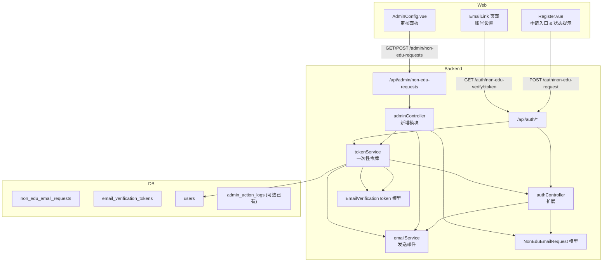

# 技术方案设计

## 架构概述

注册旁路流程将覆盖前端注册页面、后台管理员界面、后端 API 层、数据库以及邮件服务。整体采用现有 Vue 3 前端 + Express/Sequelize 后端架构，通过新增数据模型、API 路由与服务扩展原有认证模块。

## 前端设计

### 注册页扩展（Register.vue）
- 在邮箱验证步骤增加“没有学校邮箱？联系管理员”按钮。
- 点击后弹出对话框，收集`personalEmail`和`reason`，调用`authService.requestNonEduEmail`。
- 显示提交成功/失败提示；保存 `requestStatus` 用于防止重复提交。
- 若已有待审核状态，从后端获取状态并展示。

### 新建账号设置页面
- 新增路由 `/non-edu/verify/:token` 对应页面 `NonEduComplete.vue`。
- 页面展示：显示个人邮箱（从接口返回）、输入用户名、密码、确认密码。调用新的 `authService.completeNonEduRegistration`.
- 处理链接失效、已使用提示。

### 管理后台扩展
- 在 `AdminConfig.vue` 中添加菜单项“非 edu 邮箱申请”。
- 新建组件或内嵌区域显示申请列表（分页/按状态筛选）。
- 操作按钮：通过（输入可选备注）/驳回（填写原因），调用 admin API。
- 列表展示审批日志和状态。

### 前端 API 服务
- `frontend/src/services/auth.ts` 新增：
  - `requestNonEduEmail`,
  - `getNonEduRequestStatus`,
  - `completeNonEduRegistration`.
- 新增 `frontend/src/services/admin.ts` 扩展或创建新服务文件，包含获取申请列表/审批 API。

## 后端设计

### 数据模型与迁移
1. **non_edu_email_requests**
   - `id`, `username`, `personal_email`, `reason`, `status` (`pending|approved|rejected|verified`), `admin_id`, `admin_note`, `rejected_reason`, `created_at`, `updated_at`.
2. **email_verification_tokens**
   - `id`, `user_id` (可空，审批通过前为空), `request_id`, `token_hash`, `expires_at`, `used_at`, `type` (`non_edu_onboarding`), `email`.
3. 可复用现有 `admin_action_logs` 若无则考虑新增表或在请求表中记录操作字段。

### 控制器与路由
- `authController` 新增：
  - `requestNonEduEmail`：校验输入、确保注册第一步信息已通过（可采用临时缓存或重复提交校验）、创建申请、发送确认邮件给管理员或只提示用户。
  - `getNonEduRequestStatus`：供用户查询状态。
  - `completeNonEduRegistration`：验证 token，创建用户（与现有 register 逻辑共享）、标记邮箱验证，更新申请状态为 `verified`，废弃 token。
- `adminController` 新增模块：
  - `listNonEduRequests` (支持状态筛选)。
  - `approveNonEduRequest`：生成一次性 token，发送验证邮件。
  - `rejectNonEduRequest`：保存原因，发送拒绝邮件。
- `routes/auth.js` 与 `routes/admin.js` 按需挂载新路由，注意管理员路由需 `authenticate` + `requireAdmin` 中间件。

### 服务层
- `emailService` 增加：
  - 邮件模板：申请通知、审批通过包含链接、驳回通知。
- 新建 `tokenService` 或在 `emailService` 中处理一次性 token：
  - 生成随机字符串，存储哈希。
  - 验证、失效处理。
- `authService`（后端）或新建 `nonEduRequestService` 负责数据库操作与状态更新。

### 安全与校验
- 所有输入使用 `express-validator` 或自定义校验；邮箱使用通用校验。
- Token 存储哈希 (`crypto.createHash('sha256')`)；验证时比较哈希。
- Token 24 小时过期，cron/定时任务或在查询时自动清理过期记录。
- 审批路由记录 `admin_id`（可从 JWT 中获取）。

## API 设计 (RESTful)

| 方法 | 路径 | 描述 | 鉴权 |
| ---- | ---- | ---- | ---- |
| POST | `/api/auth/non-edu-request` | 用户提交无学校邮箱申请 | 公共（需先通过基本信息表单） |
| GET | `/api/auth/non-edu-request/status` | 获取当前用户名或邮箱的申请状态 | 通过 basic 信息后使用 | 
| POST | `/api/admin/non-edu-requests/search` 或 GET | 管理员获取申请列表 | 管理员 |
| POST | `/api/admin/non-edu-requests/:id/approve` | 审批通过并发送邮件 | 管理员 |
| POST | `/api/admin/non-edu-requests/:id/reject` | 驳回申请并通知 | 管理员 |
| GET | `/api/auth/non-edu-verify/:token` | 校验 token，返回账号设置所需信息 | 公共 |
| POST | `/api/auth/non-edu-complete` | 设置用户名/密码完成注册 | 公共（携带 token） |

## 测试策略

- **单元测试**：为新服务函数、token 生成验证逻辑、控制器分支编写 Jest 测试。
- **集成测试**：覆盖申请提交 -> 管理员审批 -> 邮件链接完成注册的 happy path；以及驳回、重复提交、过期 token。
- **前端测试**：若已有 Vite 测试框架，对 `Register.vue` 新逻辑编写组件测试；否则通过手动 QA 并记录。

## 运维与配置

- 新增环境变量：
  - `NON_EDU_EMAIL_APPROVER` (可选，用于通知管理员的邮箱列表)。
  - `APP_BASE_URL` 或 `WEB_BASE_URL`，用于生成邮件链接。
- 部署前运行新的 Sequelize 迁移，确保表结构就绪。
- 邮件模板 HTML 存放在服务层，复用现有 transporter。

## 潜在风险与缓解

- **邮件延迟/失败**：发送失败需 retry 或提示管理员；审批通过时若发送失败，保持状态不变并告知前端。
- **token 泄漏**：使用 HTTPS、哈希存储、一次性 token；在日志中避免输出完整 token。
- **重复账号**：在最终创建用户时再次校验邮箱唯一性；若存在未激活账号，可提示管理员处理。
